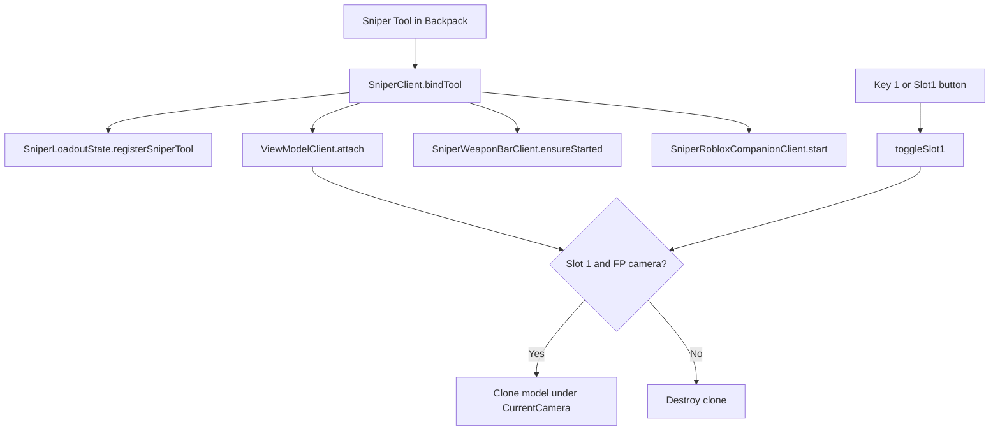

# Sniper loadout and viewmodel

How the game decides whether you are “holding” the sniper, when the first-person gun is visible, and how that ties to the real `Tool`.

---

## Two play modes (`Config`)

Everything hinges on **`SniperVirtualInventoryEnabled`** in `Config.lua`.

| Mode | Tool on the character | “Armed” is determined by… |
|------|------------------------|---------------------------|
| **Virtual (default)** | Sniper stays in **`Backpack`** (not moved to `Character` via normal equip) | Virtual inventory slot + first-person camera |
| **Classic** | Sniper is parented to **`Character`** (normal equipped Tool) | Equipped Tool + first-person camera |

With virtual mode on, the server also accepts shots by reading the Tool from **`Backpack`**; it does not require the Tool to be in the character’s hands.

---

## Virtual inventory: what “armed” means

There is no `Tool` in the avatar’s hands. **Armed** means:

1. The **Sniper** `Tool` exists in **`Backpack`** (name `Config.ToolName`, e.g. `"Sniper"`).
2. The client has registered that reference (`SniperLoadoutState.registerSniperTool`).
3. **Slot 1** is selected (`selectedSlot == 1`).

Core module: **`SniperLoadoutState.lua`** (client-only, in-memory state).

- **`registerSniperTool` / `clearSniperTool`**: which `Tool` counts as this player’s sniper.
- **`isSniperActive(tool)`**: is this Tool logically “in hand”? → virtual ON + same Tool + slot 1.
- **`isVirtualSniperHeld()`**: shortcut for other systems (e.g. parkour): virtual ON + registered Tool + slot 1.
- **`toggleSlot1` / `setSelectedSlot`**: turn the sniper slot on or off.

### Changing the slot (UI and key)

- **`SniperWeaponBarClient`**: bottom bar with a **Slot1** button (or it builds one if missing).
- Key **`1`** (or **Keypad 1**): toggles the same slot.

This only updates local state; it **does not move** the Tool between Backpack and Character.

### Roblox integration (`SniperRobloxCompanionClient`)

With virtual ON it can:

- **Hide the default Roblox hotbar** while the Sniper Tool exists in Backpack (`SniperHideRobloxDefaultBackpack`).
- **Force first person** while the sniper slot is active (`SniperForceFirstPersonWhileSniperActive`), saving and restoring camera mode/zoom when you disarm.

---

## First-person gate (`SniperFirstPersonGate`)

Viewmodel, crosshair, and valid client fire require the camera to be **close to first-person**:

- If **`CameraMode == LockFirstPerson`** → always counts as first person.
- Otherwise: **camera ↔ focus** distance ≤ `CameraMinZoomDistance + margin`, **or** ≤ `SniperViewModelMaxOrbitDistance` (close orbit even if not strict 0.5).

If you zoom/orbit too far out, the **viewmodel and reticle disappear** (and in virtual mode `SniperClient` will not let you fire).

---

## Viewmodel: what it is and when it shows

The **viewmodel** is a **cloned `Model`** from **ReplicatedStorage** parented to **`Workspace.CurrentCamera`**, not the character. Client-side visuals only.

Module: **`ViewModelClient.lua`**.

### Template location

- Folder: `ReplicatedStorage` → `Config.ViewModelsFolderName` (e.g. **`ViewModels`**).
- Template: child named `Config.SniperViewModelName` (e.g. **`Sniper`**). Keep that tree as Studio assets only (no scripts in the template folder).

### When the clone is shown (`shouldShowViewmodel`)

**Virtual mode**

1. Tool is in the player’s **`Backpack`** (not `Character`).
2. `SniperLoadoutState.isSniperActive(tool)` is true (slot 1).
3. `SniperFirstPersonGate.isCameraCloseForFirstPerson(player)` is true.

**Classic mode**

1. Tool is on **`Character`** (equipped).
2. Same close-camera check.

If anything fails (missing template, wrong slot, camera too far), the clone is destroyed and side effects are cleared (pointer suppression, mouse filter, etc.).

### Every frame

- `RunService` runs **`updateOne`**: creates/updates the clone, applies **`SniperViewModelCameraCFrame`** (offset from camera) or the **animator** if animations are configured.
- Optional: hide the real character’s **arms/hands** (`LocalTransparencyModifier`) so they do not clip through the gun.
- Optional: **Mouse.TargetFilter** = clone so mouse rays do not hit the gun.

### API for other scripts

- **`getViewModelPartWorldCFrame(tool, partName)`** → world `CFrame` of a `BasePart` inside the clone (when the viewmodel is visible).
- **`getViewModelPart(tool, partName)`** → the **`BasePart`** (e.g. for muzzle smoke parented to `Muzzle`).

---

## Flow overview (virtual mode)

---

## Firing (client) in one line

With virtual ON, **`SniperClient`** listens for **left click** when: Tool in Backpack + sniper active + first person; it sends origin/direction to the server. Origin priority: viewmodel **`Barrel`**, then Tool barrel, then camera ray (server validates distance from head).

---

## Named parts on Tool and viewmodel clone

Use the **same names** on the Tool asset and on the viewmodel clone (unless you rely on camera fallback only):

| Name (configurable) | Role |
|---------------------|------|
| **`FireOriginPartName`** (e.g. `Barrel`) | Hitscan / trail origin |
| **`SniperMuzzleSmokePartName`** (e.g. `Muzzle`) | Muzzle flash + smoke (child `Attachment`) |
| **`CasingEjectPartName`** (e.g. `CasingEject`) | Shell spawn position/orientation |

See comments in **`Config.lua`** for details.

---

## Server (`SniperServer.server.lua`)

- **Virtual ON**: resolves the Tool from **Backpack**; client-reported fire origin must be **near the head** (`SniperMaxFireOriginFromHeadStuds`).
- **Virtual OFF**: can validate against the Tool **`Barrel`** and max drift (`MaxOriginDriftStuds`), etc.

---

## Files to open when changing behavior

| Topic | File |
|--------|------|
| Global flags | `Config.lua` |
| Slot / virtual “armed” state | `SniperLoadoutState.lua` |
| Viewmodel | `ViewModelClient.lua`, `SniperViewModelAnimator.lua` |
| Bar + key 1 | `SniperWeaponBarClient.lua` |
| Camera / Roblox hotbar | `SniperRobloxCompanionClient.lua` |
| Close camera = first person | `SniperFirstPersonGate.lua` |
| Input, fire, client VFX | `SniperClient.lua` |
| Authoritative hitscan | `ServerScriptService/Sniper/SniperServer.server.lua` |

---

## Turning off virtual inventory

In **`Config.lua`**, set **`SniperVirtualInventoryEnabled = false`**. Flow returns to **Tool equipped on `Character`**; the viewmodel only shows with the Tool in hands and the same camera rule.
